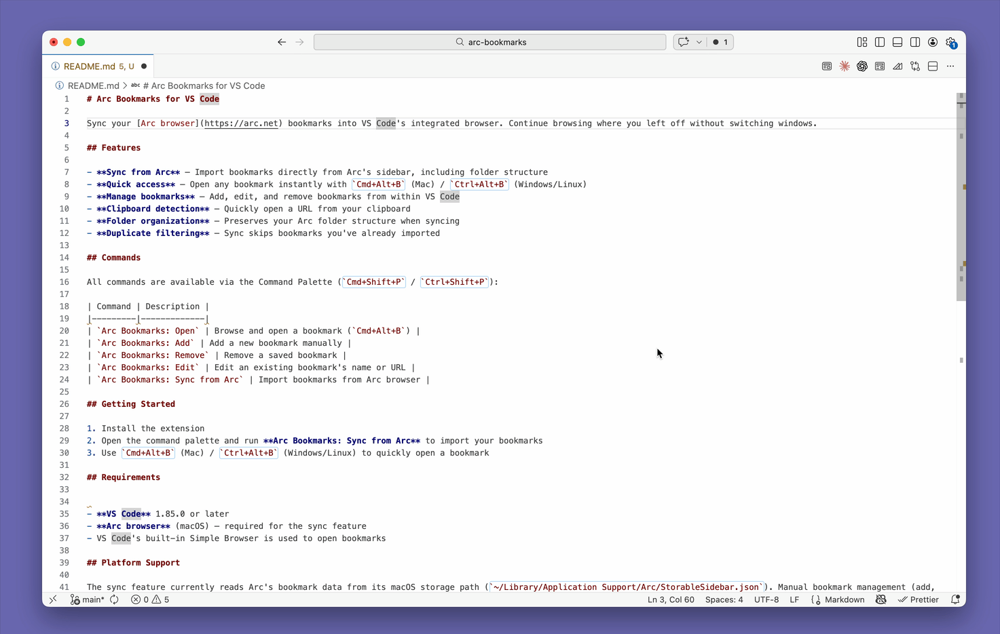

# Arc Bookmarks for VS Code



Sync your [Arc browser](https://arc.net) bookmarks into VS Code's integrated browser. Continue browsing where you left off without switching windows.

## Features

- **Sync from Arc** — Import bookmarks directly from Arc's sidebar, including folder structure
- **Quick access** — Open any bookmark instantly with `Cmd+Alt+B` (Mac) / `Ctrl+Alt+B` (Windows/Linux)
- **Manage bookmarks** — Add, edit, and remove bookmarks from within VS Code
- **Clipboard detection** — Quickly open a URL from your clipboard
- **Folder organization** — Preserves your Arc folder structure when syncing
- **Duplicate filtering** — Sync skips bookmarks you've already imported

## Commands

All commands are available via the Command Palette (`Cmd+Shift+P` / `Ctrl+Shift+P`):

| Command | Description |
|---------|-------------|
| `Arc Bookmarks: Open` | Browse and open a bookmark (`Cmd+Alt+B`) |
| `Arc Bookmarks: Add` | Add a new bookmark manually |
| `Arc Bookmarks: Remove` | Remove a saved bookmark |
| `Arc Bookmarks: Edit` | Edit an existing bookmark's name or URL |
| `Arc Bookmarks: Sync from Arc` | Import bookmarks from Arc browser |

## Getting Started

1. Install the extension
2. Open the command palette and run **Arc Bookmarks: Sync from Arc** to import your bookmarks
3. Use `Cmd+Alt+B` (Mac) / `Ctrl+Alt+B` (Windows/Linux) to quickly open a bookmark

## Requirements


- **VS Code** 1.85.0 or later
- **Arc browser** (macOS) — required for the sync feature
- VS Code's built-in Simple Browser is used to open bookmarks

## Platform Support

The sync feature currently reads Arc's bookmark data from its macOS storage path (`~/Library/Application Support/Arc/StorableSidebar.json`). Manual bookmark management (add, edit, remove, open) works on all platforms.

## Development

```sh
git clone https://github.com/sergivalverde/arc-bookmarks.git
cd arc-bookmarks
npm install
npm run compile
```

To run in development mode, press `F5` in VS Code to launch an Extension Development Host.

## License

[MIT](LICENSE)
